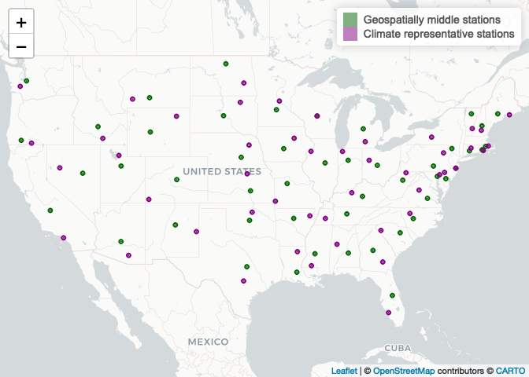
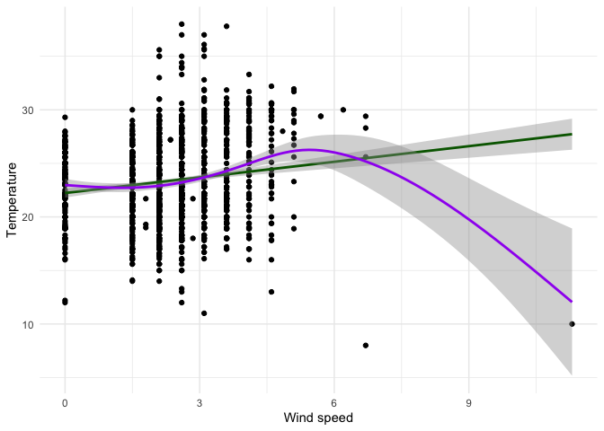
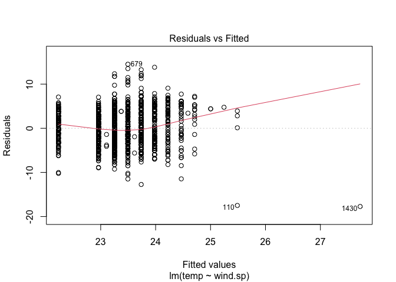
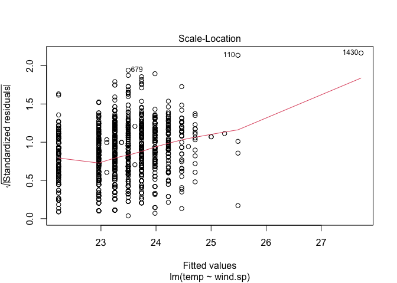
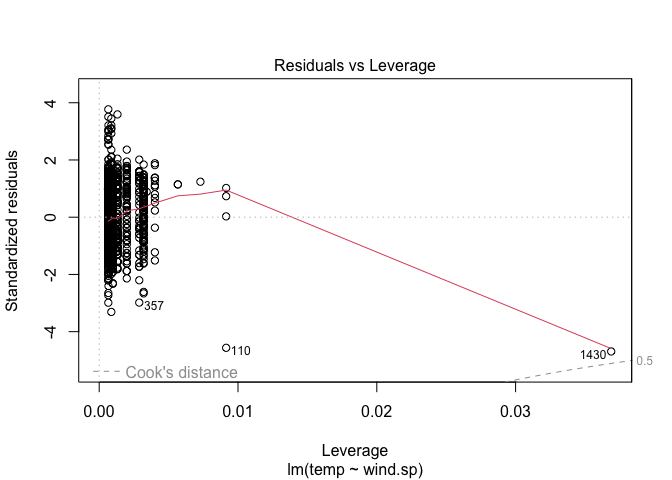
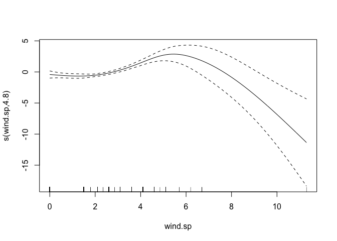

Lab 05 - Data Wrangling
================

# Learning goals

- Use the `merge()` function to join two datasets.
- Deal with missings and impute data.
- Identify relevant observations using `quantile()`.
- Practice your GitHub skills.

# Lab description

For this lab we will be dealing with the meteorological dataset `met`.
In this case, we will use `data.table` to answer some questions
regarding the `met` dataset, while at the same time practice your
Git+GitHub skills for this project.

This markdown document should be rendered using `github_document`
document.

# Part 1: Setup a Git project and the GitHub repository

1.  Go to wherever you are planning to store the data on your computer,
    and create a folder for this project

2.  In that folder, save [this
    template](https://github.com/JSC370/jsc370-2023/blob/main/labs/lab05/lab05-wrangling-gam.Rmd)
    as “README.Rmd”. This will be the markdown file where all the magic
    will happen.

3.  Go to your GitHub account and create a new repository of the same
    name that your local folder has, e.g., “JSC370-labs”.

4.  Initialize the Git project, add the “README.Rmd” file, and make your
    first commit.

5.  Add the repo you just created on GitHub.com to the list of remotes,
    and push your commit to origin while setting the upstream.

Most of the steps can be done using command line:

``` sh
# Step 1
cd ~/Documents
mkdir JSC370-labs
cd JSC370-labs

# Step 2
wget https://raw.githubusercontent.com/JSC370/jsc370-2023/main/labs/lab05/lab05-wrangling-gam.Rmd
mv lab05-wrangling-gam.Rmd README.Rmd
# if wget is not available,
curl https://raw.githubusercontent.com/JSC370/jsc370-2023/main/labs/lab05/lab05-wrangling-gam.Rmd --output README.Rmd

# Step 3
# Happens on github

# Step 4
git init
git add README.Rmd
git commit -m "First commit"

# Step 5
git remote add origin git@github.com:[username]/JSC370-labs
git push -u origin master
```

You can also complete the steps in R (replace with your paths/username
when needed)

``` r
# Step 1
setwd("~/Documents")
dir.create("JSC370-labs")
setwd("JSC370-labs")

# Step 2
download.file(
  "https://raw.githubusercontent.com/JSC370/jsc370-2023/main/labs/lab05/lab05-wrangling-gam.Rmd",
  destfile = "README.Rmd"
  )

# Step 3: Happens on Github

# Step 4
system("git init && git add README.Rmd")
system('git commit -m "First commit"')

# Step 5
system("git remote add origin git@github.com:[username]/JSC370-labs")
system("git push -u origin master")
```

Once you are done setting up the project, you can now start working with
the MET data.

## Setup in R

1.  Load the `data.table` (and the `dtplyr` and `dplyr` packages if you
    plan to work with those).

2.  Load the met data from
    <https://github.com/JSC370/jsc370-2023/blob/main/labs/lab03/met_all.gz>
    or (Use
    <https://raw.githubusercontent.com/JSC370/jsc370-2023/main/labs/lab03/met_all.gz>
    to download programmatically), and also the station data. For the
    latter, you can use the code we used during lecture to pre-process
    the stations data:

``` r
library(data.table)
library(dtplyr) # translator between dplyr (tidyverse) and data.table
library(dplyr)
```

    ## 
    ## Attaching package: 'dplyr'

    ## The following objects are masked from 'package:data.table':
    ## 
    ##     between, first, last

    ## The following objects are masked from 'package:stats':
    ## 
    ##     filter, lag

    ## The following objects are masked from 'package:base':
    ## 
    ##     intersect, setdiff, setequal, union

``` r
library(ggplot2)
library(leaflet)
```

``` r
# Download the data
stations <- fread("ftp://ftp.ncdc.noaa.gov/pub/data/noaa/isd-history.csv")
stations[, USAF := as.integer(USAF)]
```

    ## Warning in eval(jsub, SDenv, parent.frame()): NAs introduced by coercion

``` r
# Dealing with NAs and 999999
stations[, USAF   := fifelse(USAF == 999999, NA_integer_, USAF)]
stations[, CTRY   := fifelse(CTRY == "", NA_character_, CTRY)]
stations[, STATE  := fifelse(STATE == "", NA_character_, STATE)]

# Selecting the three relevant columns, and keeping unique records
stations <- unique(stations[, list(USAF, CTRY, STATE)])

# Dropping NAs
stations <- stations[!is.na(USAF)]

# Removing duplicates
stations[, n := 1:.N, by = .(USAF)]
stations <- stations[n == 1,][, n := NULL]
```

``` r
# read met dataset
if (!file.exists("met_all.gz")) {
 download.file(
      url = "https://raw.githubusercontent.com/JSC370/jsc370-2023/main/labs/lab03/met_all.gz",
      destfile = "met_all.gz",
      method   = "libcurl",
      timeout  = 60
      ) 
}
met <- data.table::fread("met_all.gz")
```

3.  Merge the data as we did during the lecture.

``` r
# data.table version
met <- merge(
  x = met,
  y = stations,
  all.x = TRUE, all.y = FALSE,
  by.x = "USAFID", by.y = "USAF"
)
```

``` r
# same operation in tidyverse (don't run)
met <- left_join(
  met, stations, by = c("USAFID" = "USAF")
)
```

``` r
# lazy version for faster tidyverse operation
met_lz <- lazy_dt(met, immutable = FALSE)
```

## Question 1: Representative station for the US

Across all weather stations, what is the median station in terms of
temperature, wind speed, and atmospheric pressure? Look for the three
weather stations that best represent continental US using the
`quantile()` function. Do these three coincide?

``` r
# average for each station
met_avg_lz <- met_lz |>
  group_by(USAFID, STATE) |>  # keep state info for Q2 & Q3
  summarise(
    across(
      c(temp, wind.sp, atm.press, lon, lat),  # lon and lat for Q3
      function(x) mean(x, na.rm = TRUE)
    ), .groups = "drop"
  )
# find medians of temp, wind.sp, atm.press
met_med_lz <- met_avg_lz |>
  summarise(across(
    3:5,
    function(x) quantile(x, probs = .5, na.rm = TRUE)
  ))
# temperature
temp_us_id <- met_avg_lz |>
  mutate(
    d = abs(temp - met_med_lz |> pull(temp))
    ) |>
  arrange(d) |>
  slice(1) |>
  pull(USAFID)
# wind speed
wsp_us_id <- met_avg_lz |>
  mutate(
    d = abs(wind.sp - met_med_lz |> pull(wind.sp))
    ) |>
  arrange(d) |>
  slice(1) |>
  pull(USAFID)
# atm speed
atm_us_id <- met_avg_lz |>
  mutate(
    d = abs(atm.press - met_med_lz |> pull(atm.press))
    ) |>
  arrange(d) |>
  slice(1) |>
  pull(USAFID)
# Display with the geolocation info
met_lz |>
  group_by(USAFID) |>
  # smome stations have multiple values
  summarise(lon = mean(lon), lat = mean(lat)) |> 
  filter(USAFID %in% c(temp_us_id, wsp_us_id, atm_us_id)) 
```

    ## Source: local data table [3 x 3]
    ## Call:   `_DT1`[, .(lon = mean(lon), lat = mean(lat)), keyby = .(USAFID)][USAFID %in% 
    ##     c(temp_us_id, wsp_us_id, atm_us_id)]
    ## 
    ##   USAFID   lon   lat
    ##    <int> <dbl> <dbl>
    ## 1 720458 -82.6  37.8
    ## 2 720929 -92.0  45.5
    ## 3 722238 -85.7  31.3
    ## 
    ## # Use as.data.table()/as.data.frame()/as_tibble() to access results

``` r
# for "pretty" printing
met_lz |>
  group_by(USAFID) |>
  # smome stations have multiple values
  summarise(lon = mean(lon), lat = mean(lat)) |> 
  filter(USAFID %in% c(temp_us_id, wsp_us_id, atm_us_id)) |>
  mutate("Variable" = c("Temperature", "Wind speed", "Atmospheric pressure")) |>
  select(Variable, USAFID, lon, lat) |>
  as_tibble()
```

    ## # A tibble: 3 × 4
    ##   Variable             USAFID   lon   lat
    ##   <chr>                 <int> <dbl> <dbl>
    ## 1 Temperature          720458 -82.6  37.8
    ## 2 Wind speed           720929 -92.0  45.5
    ## 3 Atmospheric pressure 722238 -85.7  31.3

``` r
# data.table version
# mean per station
station_avg <- met[ , .(
  temp      = mean(temp, na.rm = TRUE),
  wind.sp   = mean(wind.sp, na.rm = TRUE),
  atm.press = mean(atm.press, na.rm = TRUE),
  lat       = mean(lat),
  lon       = mean(lon)
), by = .(USAFID, STATE)] # keep state info for Q2 & Q3
# medain across the US
usa_median <- station_avg[ , .(
  temp_50      = quantile(temp, probs = .5, na.rm = TRUE),
  wind.sp_50   = quantile(wind.sp, probs = .5, na.rm = TRUE),
  atm.press_50 = quantile(atm.press, probs = .5, na.rm = TRUE)
)]
# find the stations closest to the median values
station_avg[ , d_temp := abs(temp - usa_median$temp_50)]
station_avg[ , d_wind.sp   := abs(wind.sp - usa_median$wind.sp_50)]
station_avg[ , d_atm.press := abs(atm.press - usa_median$atm.press_50)]
# temperature
station_avg[order(d_temp), .(USAFID, STATE, temp)][1]
# wind speed
station_avg[order(d_wind.sp), .(USAFID, STATE, wind.sp)][1]
# atm pressure
station_avg[order(d_atm.press), .(USAFID, STATE, atm.press)][1]
```

Knit the document, commit your changes, and save it on GitHub. Don’t
forget to add `README.md` to the tree, the first time you render it.

## Question 2: Representative station per state

Just like the previous question, you are asked to identify what is the
most representative, the median, station per state. This time, instead
of looking at one variable at a time, look at the euclidean distance. If
multiple stations show in the median, select the one located at the
lowest latitude.

``` r
# function for computing Euclidean distance
udist <- function(pt1, pt2) {
  sqrt(sum((pt1 - pt2)^2))
}
# example usage
udist(c(1,1), c(3,3))
```

    ## [1] 2.828427

``` r
# example usage
udist(c(1,1,1), c(3,3,3))
```

    ## [1] 3.464102

``` r
# tidyverse
# compute median per state
state_med_lz <- met_avg_lz |>
  group_by(STATE) |>
  summarise(
    across(2:4, function(x) quantile(x, probs = .5, na.rm = TRUE),
           .names = "{.col}_50"), # name columns with "_50"
    .groups = "drop"
  )
# find the minimum Euclidean distance stations
state_med_stations_lz <- met_avg_lz |>
  left_join(state_med_lz, by = "STATE") |>
  collect() |> rowwise() |> # to sum() row wise
  mutate(d = udist(c(temp, wind.sp, atm.press), 
                   c(temp_50, wind.sp_50, atm.press_50))) |>
  group_by(STATE) |>
  slice_min(d) # find the minimum d row
state_med_stations_lz
```

    ## # A tibble: 46 × 11
    ## # Groups:   STATE [46]
    ##    USAFID STATE  temp wind.sp atm.press    lon   lat temp_50 wind.sp_50 atm.pr…¹
    ##     <int> <chr> <dbl>   <dbl>     <dbl>  <dbl> <dbl>   <dbl>      <dbl>    <dbl>
    ##  1 722286 AL     26.4    1.68     1015.  -87.6  33.2    26.3       1.66    1015.
    ##  2 723407 AR     25.9    2.21     1015.  -90.6  35.8    26.2       1.94    1015.
    ##  3 722745 AZ     30.3    3.31     1010. -111.   32.2    30.3       3.07    1010.
    ##  4 722970 CA     22.8    2.33     1013. -118.   33.8    22.7       2.57    1013.
    ##  5 724767 CO     22.0    2.78     1014. -109.   37.3    21.5       3.10    1013.
    ##  6 725087 CT     22.6    2.13     1015.  -72.7  41.7    22.4       2.10    1015.
    ##  7 724180 DE     24.6    2.75     1015.  -75.6  39.7    24.6       2.75    1015.
    ##  8 722106 FL     27.5    2.71     1015.  -81.9  26.6    27.6       2.71    1015.
    ##  9 723160 GA     26.6    1.68     1015.  -82.5  31.5    26.7       1.50    1015.
    ## 10 725480 IA     21.4    2.76     1015.  -92.4  42.6    21.3       2.68    1015.
    ## # … with 36 more rows, 1 more variable: d <dbl>, and abbreviated variable name
    ## #   ¹​atm.press_50

Note that the result includes only 46 states. There are 48 state in
continental US.

``` r
# which states are missing?
state_orig <- met |> distinct(STATE) |> pull(STATE) 
state_46 <- state_med_stations_lz |> pull(STATE)
state_missing <- state_orig[!state_orig %in% state_46]
state_med_lz |>
  filter(STATE %in% state_missing) |>
  as_tibble()
```

    ## # A tibble: 2 × 4
    ##   STATE temp_50 wind.sp_50 atm.press_50
    ##   <chr>   <dbl>      <dbl>        <dbl>
    ## 1 ND       18.5       3.96           NA
    ## 2 WA       19.2       1.27           NA

All stations in ND and WA are missing atmospheric pressure values. One
way of handling the issue would be ignoring any measurement with missing
values when computing the Euclidean distance.

``` r
# function for computing Euclidean distance
udist_handle_missing <- function(pt1, pt2) {
  pt1[is.na(pt1) | is.na(pt2)] <- 0
  pt2[is.na(pt1) | is.na(pt2)] <- 0
  sqrt(sum((pt1 - pt2)^2))
}
```

``` r
# find the minimum Euclidean distance stations
state_med_stations_lz_handle_missing <- met_avg_lz |>
  left_join(state_med_lz, by = "STATE") |>
  collect() |> rowwise() |> # to sum() row wise
  mutate(d = udist_handle_missing(
    c(temp, wind.sp, atm.press), 
    c(temp_50, wind.sp_50, atm.press_50))) |>
  group_by(STATE) |>
  slice_min(d) # find the minimum d row
state_med_stations_lz_handle_missing
```

    ## # A tibble: 48 × 11
    ## # Groups:   STATE [48]
    ##    USAFID STATE  temp wind.sp atm.press    lon   lat temp_50 wind.sp_50 atm.pr…¹
    ##     <int> <chr> <dbl>   <dbl>     <dbl>  <dbl> <dbl>   <dbl>      <dbl>    <dbl>
    ##  1 722286 AL     26.4    1.68     1015.  -87.6  33.2    26.3       1.66    1015.
    ##  2 723407 AR     25.9    2.21     1015.  -90.6  35.8    26.2       1.94    1015.
    ##  3 722745 AZ     30.3    3.31     1010. -111.   32.2    30.3       3.07    1010.
    ##  4 722970 CA     22.8    2.33     1013. -118.   33.8    22.7       2.57    1013.
    ##  5 724767 CO     22.0    2.78     1014. -109.   37.3    21.5       3.10    1013.
    ##  6 725087 CT     22.6    2.13     1015.  -72.7  41.7    22.4       2.10    1015.
    ##  7 724180 DE     24.6    2.75     1015.  -75.6  39.7    24.6       2.75    1015.
    ##  8 722106 FL     27.5    2.71     1015.  -81.9  26.6    27.6       2.71    1015.
    ##  9 723160 GA     26.6    1.68     1015.  -82.5  31.5    26.7       1.50    1015.
    ## 10 725480 IA     21.4    2.76     1015.  -92.4  42.6    21.3       2.68    1015.
    ## # … with 38 more rows, 1 more variable: d <dbl>, and abbreviated variable name
    ## #   ¹​atm.press_50

``` r
# data.table version
# medain across the US
station_avg[ , temp_state_50 := quantile(
  temp, probs = .5, na.rm = TRUE
  ), by = STATE]
station_avg[ , wind.sp_state_50 := quantile(
  wind.sp, probs = .5, na.rm = TRUE
  ), by = STATE]
station_avg[ , atm.press_state_50 := quantile(
  atm.press, probs = .5, na.rm = TRUE
  ), by = STATE]
# find the stations closest to the median values
station_avg[ , metdist := udist_handle_missing(
  c(temp, wind.sp, atm.press),
  c(temp_state_50, wind.sp_state_50, atm.press_state_50)),
  by = 1:nrow(station_avg)] # by 1:nrow() has the same effect as row.wise()
# select the top
station_avg[ , .SD[which.min(metdist)], by = STATE]
```

Knit the doc and save it on GitHub.

## Question 3: In the middle?

For each state, identify what is the station that is closest to the
mid-point of the state. Combining these with the stations you identified
in the previous question, use `leaflet()` to visualize all \~100 points
in the same figure, applying different colors for those identified in
this question.

``` r
# tidyverse
# compute geospatial centre per state
state_centre_lz <- met_avg_lz |>
  group_by(STATE) |>
  summarise(
    across(c(lat, lon), function(x) quantile(x, probs = .5, na.rm = TRUE),
           .names = "{.col}_50"), # name columns with "_50"
    .groups = "drop"
  )
# find the minimum Euclidean distance stations
state_centre_stations_lz <- met_avg_lz |>
  left_join(state_centre_lz, by = "STATE") |>
  collect() |> rowwise() |> # to sum() row wise
  mutate(d = udist(c(lat, lon), 
                   c(lat_50, lon_50))) |>
  group_by(STATE) |>
  slice_min(d) # find the minimum d row
# map
stations_map <- leaflet() |>
  addProviderTiles("CartoDB.Positron") |>
  addCircles(
    data = state_centre_stations_lz,
    lat = ~lat, lng = ~lon, popup = "Geospatial mid",
    opacity = 1, fillOpacity = 1, radius = 20, color = "darkgreen"
  ) |>
  addCircles(
    data = state_med_stations_lz_handle_missing,
    lat = ~lat, lng = ~lon, popup = "Climate mid",
    opacity = 1, fillOpacity = 1, radius = 20, color = "purple"
  ) |>
  addLegend(
    colors = c("darkgreen", "purple"),
    labels = c("Geospatially middle stations", "Climate representative stations")
  )
# use mapview::mapshot to convert the map to a static image file and
# display on github (credit: Chan Yu)
mapview::mapshot(stations_map, file = "mapview.png")
stations_map
```

<!-- -->

*`data.table` version omitted. See Q3.*

Knit the doc and save it on GitHub.

## Question 4: Means of means

Using the `quantile()` function, generate a summary table that shows the
number of states included, average temperature, wind-speed, and
atmospheric pressure by the variable “average temperature level,” which
you’ll need to create.

Start by computing the states’ average temperature. Use that measurement
to classify them according to the following criteria:

- low: temp \< 20
- Mid: temp \>= 20 and temp \< 25
- High: temp \>= 25

``` r
# tidyverse
met_hml_lz <- met_lz |>
  group_by(STATE) |>
  summarise(
    n_entries = n(),
    n_entries_na = sum(is.na(temp)),
    n_stations = n_distinct(USAFID),
    across(c(temp, wind.sp, atm.press), function(x) mean(x, na.rm = TRUE)),
    .groups = "drop"
  ) |>
  mutate(
    state_temp_cat = if_else(
      temp < 20, "Low",
      if_else(temp < 25, "Mid", "High")
    )
  )
```

Once you are done with that, you can compute the following:

- Number of entries (records),
- Number of NA entries,
- Number of stations,
- Number of states included, and
- Mean temperature, wind-speed, and atmospheric pressure.

All by the levels described before.

``` r
met_hml_lz |>
  mutate(
    state_temp_cat = factor(state_temp_cat, levels = c("High", "Mid", "Low")) # order
  ) |>
  group_by(state_temp_cat) |>
  summarise(
    n_state = n(),
    n_stations = sum(n_stations),
    n_records = sum(n_entries),
    n_entries_na = sum(n_entries_na),
    temp = mean(temp, na.rm = TRUE),
    wind.sp = mean(wind.sp, na.rm = TRUE),
    atm.press = mean(atm.press, na.rm = TRUE)
  ) |>
  collect()
```

    ## # A tibble: 3 × 8
    ##   state_temp_cat n_state n_stations n_records n_entries_na  temp wind.sp atm.p…¹
    ##   <fct>            <int>      <int>     <int>        <int> <dbl>   <dbl>   <dbl>
    ## 1 High                12        555    811126        23468  27.0    2.43   1014.
    ## 2 Mid                 25        781   1135423        29252  22.6    2.39   1015.
    ## 3 Low                 11        259    430794         7369  18.7    2.55   1014.
    ## # … with abbreviated variable name ¹​atm.press

``` r
# data.table
met[ , state_temp := mean(temp, na.rm = TRUE), by = STATE]
met[ , state_temp_cat := factor(fifelse(
  state_temp < 20, "Low",
  fifelse(state_temp < 25, "Mid", "High")
), levels = c("High", "Mid", "Low"))]
tab <- met[ , .(
  n_state      = length(unique(STATE)),
  n_stations   = length(unique(USAFID)),
  n_entries    = .N,
  n_entries_na = sum(is.na(temp)),
  temp         = mean(temp, na.rm = TRUE),
  wind.sp      = mean(wind.sp, na.rm = TRUE),
  atm.press    = mean(atm.press, na.rm = TRUE)
), keyby = state_temp_cat] # sort by the factor levels
knitr::kable(tab) # knitr::kable() is works well for both html and pdf outputs
```

| state_temp_cat | n_state | n_stations | n_entries | n_entries_na |     temp |  wind.sp | atm.press |
|:---------------|--------:|-----------:|----------:|-------------:|---------:|---------:|----------:|
| High           |      12 |        555 |    811126 |        23468 | 27.75066 | 2.514644 |  1013.738 |
| Mid            |      25 |        781 |   1135423 |        29252 | 22.39909 | 2.352712 |  1014.383 |
| Low            |      11 |        259 |    430794 |         7369 | 18.96446 | 2.637410 |  1014.366 |

Knit the document, commit your changes, and push them to GitHub.

## Question 5: Advanced Regression

Let’s practice running regression models with smooth functions on X. We
need the `mgcv` package and `gam()` function to do this.

- using your data with the median values per station, examine the
  association between median temperature (y) and median wind speed (x).
  Create a scatterplot of the two variables using ggplot2. Add both a
  linear regression line and a smooth line.

- fit both a linear model and a spline model (use `gam()` with a cubic
  regression spline on wind speed). Summarize and plot the results from
  the models and interpret which model is the best fit and why.

``` r
met_med_tbl <- met_lz |>
  group_by(USAFID) |>
  summarise(
    across(c(temp, wind.sp), function(x) quantile(x, probs = .5, na.rm = TRUE))
  ) |>
  collect() # turn into tibble before using ggplot
ggplot(met_med_tbl, aes(x = wind.sp, y = temp)) +
  theme_minimal() +
  geom_point() +
  geom_smooth(method = "lm", formula = y ~ x, col = "darkgreen") +
  geom_smooth(method = "gam", formula = y ~ s(x, bs = "cs"), col = "purple") +
  labs(x = "Wind speed", y = "Temperature")
```

<!-- -->

``` r
lm_mod <- lm(temp ~ wind.sp, data = met_med_tbl)
summary(lm_mod)
```

    ## 
    ## Call:
    ## lm(formula = temp ~ wind.sp, data = met_med_tbl)
    ## 
    ## Residuals:
    ##      Min       1Q   Median       3Q      Max 
    ## -17.7243  -2.6518  -0.2309   2.7691  14.5052 
    ## 
    ## Coefficients:
    ##             Estimate Std. Error t value Pr(>|t|)    
    ## (Intercept) 22.23088    0.21779  102.08  < 2e-16 ***
    ## wind.sp      0.48614    0.08212    5.92 3.94e-09 ***
    ## ---
    ## Signif. codes:  0 '***' 0.001 '**' 0.01 '*' 0.05 '.' 0.1 ' ' 1
    ## 
    ## Residual standard error: 3.849 on 1577 degrees of freedom
    ##   (16 observations deleted due to missingness)
    ## Multiple R-squared:  0.02174,    Adjusted R-squared:  0.02112 
    ## F-statistic: 35.05 on 1 and 1577 DF,  p-value: 3.941e-09

``` r
plot(lm_mod)
```

<!-- --><!-- --><!-- --><!-- -->

``` r
library(mgcv)
```

    ## Loading required package: nlme

    ## 
    ## Attaching package: 'nlme'

    ## The following object is masked from 'package:dplyr':
    ## 
    ##     collapse

    ## This is mgcv 1.8-41. For overview type 'help("mgcv-package")'.

``` r
gam_mod <- gam(temp ~ s(wind.sp, bs = "cr", k = 10), data = met_med_tbl)
summary(gam_mod)
```

    ## 
    ## Family: gaussian 
    ## Link function: identity 
    ## 
    ## Formula:
    ## temp ~ s(wind.sp, bs = "cr", k = 10)
    ## 
    ## Parametric coefficients:
    ##             Estimate Std. Error t value Pr(>|t|)    
    ## (Intercept) 23.38566    0.09549   244.9   <2e-16 ***
    ## ---
    ## Signif. codes:  0 '***' 0.001 '**' 0.01 '*' 0.05 '.' 0.1 ' ' 1
    ## 
    ## Approximate significance of smooth terms:
    ##              edf Ref.df     F p-value    
    ## s(wind.sp) 4.798  5.762 13.95  <2e-16 ***
    ## ---
    ## Signif. codes:  0 '***' 0.001 '**' 0.01 '*' 0.05 '.' 0.1 ' ' 1
    ## 
    ## R-sq.(adj) =  0.0486   Deviance explained = 5.15%
    ## GCV = 14.451  Scale est. = 14.398    n = 1579

``` r
plot(gam_mod)
```

<!-- -->
